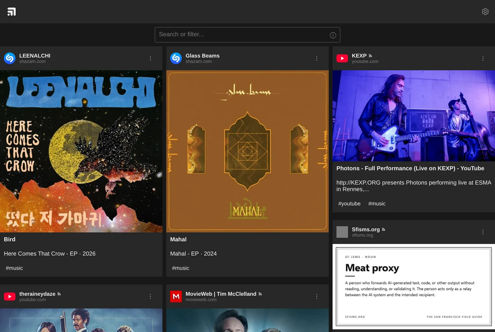
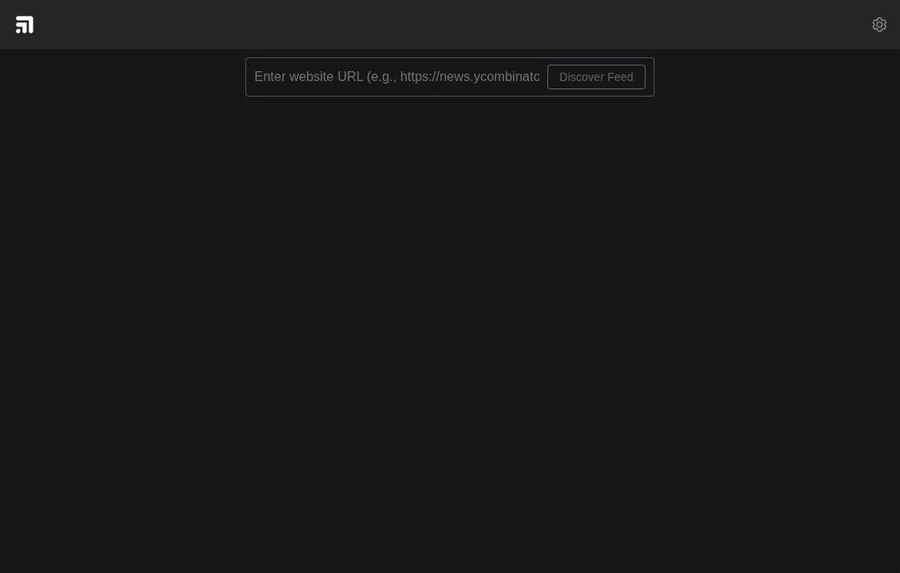
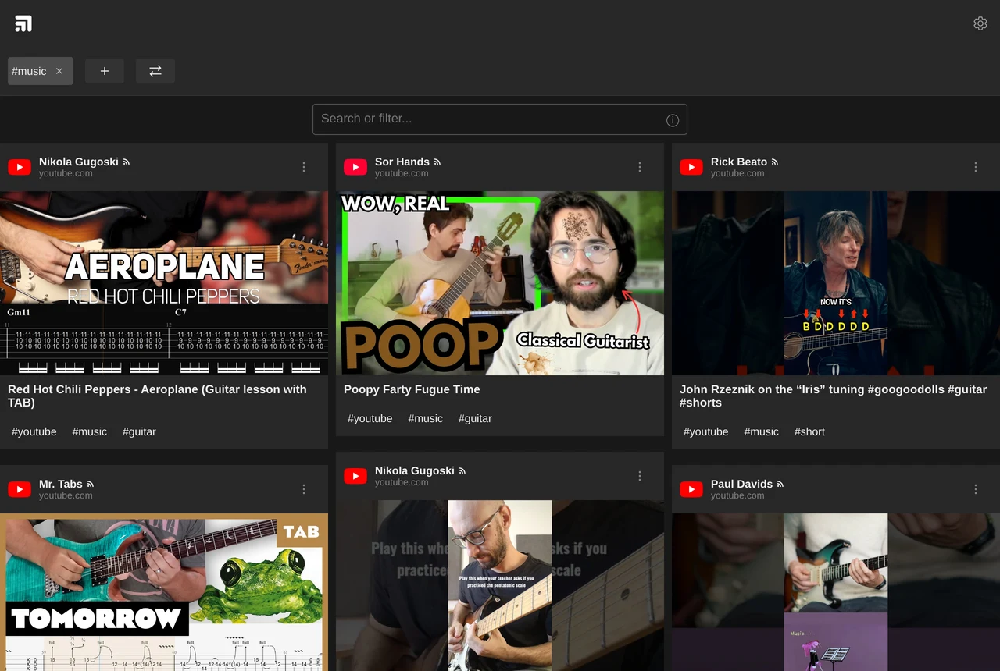

# Feeds

Feeds is a self-hosted feed reader. It follows RSS, Atom and JSON feeds, plus YouTube
channels, subreddits and some other sites that do not publish a feed of their own. Items
from every feed you follow appear in one list, newest first. The interface shows no
unread counts and does not reorder anything.

The repository is a TypeScript monorepo with three packages: a SvelteKit web app, the
core library it is built on, and a command-line tool that uses the same library.



## Features

### Minimal interface

The UI shows no unread counts, no item totals, no list lengths and no badges. This is a
design rule for the project. The reader is a list of posts with a search box and a tag
filter above it.

The theme is dark by default and can be switched to light. Posts are laid out in a
masonry grid or a single column. Both settings are stored in a cookie, so the server
renders the right one on first load.

### Feed discovery and enrichment

You give it the address of a site, such as `https://example.com`, rather than the
address of the feed. It fetches the page, looks for a `<link rel="alternate">` tag, and
if there is none, tries common locations like `/feed`, `/rss.xml` and `/index.xml`. It
also reads the site's name and icon. Before you follow the feed, you see a preview of
its actual posts.

Link aggregators such as Hacker News or Two Stop Bits need extra work. Their items link
to other sites, but the feed only contains the aggregator's own name and icon, so every
post looks the same in a reader. Discovery notices this when most items link off-site,
and switches on **Show enriched posts** for the feed. The feed page then fetches each
linked page and uses its title, author and image for the post, while keeping a link to
the discussion thread. You can turn the setting on or off later from the feed page.

Enriched posts are cached per feed and appear on the feed page, in `/all-posts` and
under `/tags`. A refresh only fetches pages for items that are new since last time, so
most of the work happens the first time you open a feed.

Discovering Hacker News, which is a link aggregator, so every item is enriched with the
title, image and description of the page it links to:



### Formats and providers

The parsers handle **RSS 2.0**, **RSS 1.0 (RDF)**, **Atom** and **JSON Feed**. **OPML**
files can be imported and exported, so you can move subscriptions in from another
reader.

Some sites need more than a parser, so they have their own handling:

| Provider        | Handling                                                                                                                                                                           |
| --------------- | ---------------------------------------------------------------------------------------------------------------------------------------------------------------------------------- |
| **YouTube**     | Channel, user, `@handle` and watch URLs are resolved to the channel feed. A watch page gives the channel name and id in one request, since YouTube limits how often you can fetch. |
| **Reddit**      | Subreddits and posts are read from the public `.rss` feed, because the unauthenticated JSON API was shut down. Image previews are taken from the entry content.                    |
| **X / Twitter** | Requests go through a nitter instance.                                                                                                                                             |
| **Shazam**      | Song links are resolved to track metadata and cover art.                                                                                                                           |

### Tags and filtering

Feeds can be tagged, and so can individual saved posts. `/tags/music` lists everything
with that tag and `/tags/music+guitar` lists what has both. When you edit tags, the app
suggests some: tags you often use together with the ones already chosen, and tags that
match the text of the post. The text matching uses a sentence embedding model
(`all-MiniLM-L6-v2`) that runs inside the app, so no data leaves the server. Search
matches the start of words in the post text, tags, author and URL, and `-word` excludes
a term.



### Saving posts to My Feed

Any link can be saved as your own post. The app fetches the page for its title, author,
image and date, and you can add tags before saving. Images and avatars of saved posts
are converted to WebP and given a blurhash placeholder. They are stored in a local
cache under their content hash, so a saved post still works if the original page
changes.

### Multiple users

A path can start with `/@name`, for example `/@bob/myfeed` or `/@bob/tags/music`. That
gives the user their own feeds, saved posts and caches in a separate directory. Without
the prefix the app runs as a single-user install. Anyone can read a user's pages, but
writing needs that user's key. See [Multi-user](#multi-user) for setup.

### RSS and JSON output

Every page that lists posts can be subscribed to. Add `.rss` or `.json` to its address
to get an RSS feed or a JSON Feed:

| Page           | Feed                                    |
| -------------- | --------------------------------------- |
| `/myfeed`      | `/myfeed.rss`, `/myfeed.json`           |
| `/all-posts`   | `/all-posts.rss`, `/all-posts.json`     |
| `/tags/music`  | `/tags/music.rss`, `/tags/music.json`   |
| `/feeds/<url>` | `/feeds.rss/<url>`, `/feeds.json/<url>` |

For an enriched feed, the last one gives you something the original feed does not have:
every item carries the title, author and image of the linked article, and the link to
the discussion is kept in `<comments>` for RSS and `external_url` for JSON Feed.

Each page also lists its feeds in a `<link rel="alternate">` tag, so a reader can find
them by itself. Feeds under a user prefix are scoped as well, which makes an address
like `/@bob/tags/music.rss` a way to share part of what you read.

### Library and CLI

`@feeds/core` is an ESM library you can use on its own. It does discovery, parsing,
enrichment, OPML handling and metadata extraction. It uses `fetch` for network access
and does not touch the disk or depend on a framework. `@feeds/cli` exposes the same
functions on the command line, which is useful for scripts and for checking what a site
returns. The web app only adds storage, caching, authentication and the UI.

### Content sanitizing

Feed descriptions are HTML written by sites you do not control. The app converts that
HTML to Markdown, dropping the tags and keeping links and images, and renders the result
as text. No part of the app renders raw HTML, so a feed cannot insert markup or scripts
into a page. Generated feeds escape their output. Cached images are stored under a
content hash instead of a name taken from the remote server. A `/@name` scope may only
contain `[a-z0-9_]`, so a path cannot reach outside the data directory.

## Installation

You need **Node.js 20 or newer** and **pnpm 9.15 or newer**.

```bash
git clone <repository-url>
cd feeds
pnpm install
pnpm build
```

Start the app in development mode on http://localhost:1337:

```bash
pnpm --filter @feeds/app dev
```

For production, build it and run the result. The app uses `@sveltejs/adapter-node`, so
the build is a Node server that listens on `PORT`, by default 3000:

```bash
pnpm --filter @feeds/app build
node packages/app/build/index.js
```

Feeds and saved posts are stored as JSON in `packages/app/static/`, and cached images in
`packages/app/cache/`. Those two directories hold all your data. See
[docs/DEPLOYMENT.md](docs/DEPLOYMENT.md) for deploying to a server.

### Configuration

| Variable         | Purpose                                                                                                                              |
| ---------------- | ------------------------------------------------------------------------------------------------------------------------------------ |
| `PORT`           | Port for the production server, by default `3000`.                                                                                   |
| `FEEDS_DATA_DIR` | Where feeds, posts and per-user directories are stored, by default `static/`.                                                        |
| `FEEDS_KEYFILE`  | Path to the write-key file, by default `users.json` next to the data directory. Keep it outside the data directory, which is public. |
| `FEEDS_CONFIG`   | Feed configuration as inline JSON.                                                                                                   |
| `FEEDS_CHANNEL`  | Path to a feed configuration file.                                                                                                   |

### Authentication

Authentication is optional and off by default. Without a key file, anyone can read and
write. When it is on, reading stays public and every write needs a key. Writes are
adding, editing and removing feeds and posts.

To turn it on, create `users.json` next to the data directory (`packages/app/users.json`
by default, or wherever `FEEDS_KEYFILE` points). It maps each scope to the key allowed
to write in it. The entry named `""` is the single-user scope, and a `"bob"` entry
covers `/@bob`:

```json
{ "": "my-secret-key", "bob": "bob-secret-key" }
```

The check runs on the server in `src/hooks.server.ts`. `POST`, `PATCH` and `DELETE`
return `401` when the caller is not authenticated, and the UI hides the write controls.
To sign in, open `/auth` and enter a key, or open `/auth?key=YOUR_KEY`. The key is kept
in an httpOnly cookie. A key works for one scope only, so sign in again at `/@bob/auth`
to write there.

### Multi-user

- **Creating a user:** open `/invite` and enter a name. You get a link that signs that
  person in on their device. This creates the `@name` directory and their key. You can
  also create the directory yourself (`static/@bob/`) and add a key to `users.json` by
  hand. Nothing else creates a user, and an unknown `/@name` returns `404`. Names may
  contain lowercase latin letters, digits and underscore. An address may use capitals
  (`/@Bob`) and still resolve to the lowercase directory, so a directory named `@Bob` is
  not a user.
- **Inviting:** `/invite` and `/invite/<name>` show write keys, so they are the only
  pages that are not public. They need the root key in the root scope, and refuse to
  work until `users.json` has a root (`""`) entry. `/invite/<name>` shows an existing
  user's link again if you need to send it once more, and creates a key for a directory
  you made by hand.
- **Storage:** each user has their own `feeds.json`, `myposts.json` and caches in their
  directory, and their images in `cache/@bob/`.
- **Listing:** `/users` lists the users that exist.

## Packages

### `@feeds/core`

Discovery, parsing, enrichment and post building. It contains no disk access and reaches
the network through `fetch`. Its only dependencies are `fast-xml-parser` and `he`.

```typescript
import { fetchFeedsFromUrl, fetchOpenGraphData, loadPosts } from '@feeds/core'

const feeds = await fetchFeedsFromUrl('https://example.com')
const posts = await loadPosts(feeds)
const og = await fetchOpenGraphData('https://example.com/article')
```

Main exports: `fetchFeedsFromUrl`, `fetchFeed`, `loadPosts`, `discoverFeedFromUrl`,
`discoverAndEnrichFeed`, `createEnrichedPost`, `parseOPML`, `fetchOpenGraphData`,
`fetchHtmlMetaDataOnly`.

### `@feeds/cli`

```bash
pnpm feeds add <url>                      # discover a feed from any URL
pnpm feeds rss <url>                      # fetch feed info
pnpm feeds discover <url>                 # metadata, including well-known path search
pnpm feeds discover-feed <url>            # discover, then enrich every item
pnpm feeds fetch-feed <feed-url>          # posts from one feed
pnpm feeds fetch <feeds-file> [-m <n>]    # posts from a feeds file
pnpm feeds opengraph <url>                # OpenGraph data
pnpm feeds metadata <url>                 # HTML metadata
pnpm feeds opml <url>                     # download and convert OPML
pnpm feeds opml-import <file-or-url> [-o <file>]
pnpm feeds merge-feeds <files...> [-o <file>]
pnpm feeds --help
```

### `@feeds/app`

The SvelteKit reader: pages, API endpoints, storage, image processing and
authentication. It calls the core library for parsing and discovery instead of
implementing them again.

## Project structure

```
feeds/
├── packages/
│   ├── core/           # The engine
│   │   ├── src/
│   │   │   ├── models/     # Feed, Post, Author, RSS types
│   │   │   ├── parsers/    # RSS, Atom, JSON Feed, OPML, HTML metadata
│   │   │   ├── providers/  # YouTube, Reddit, X/Twitter, Shazam
│   │   │   └── utils/      # URL, date, fetch, favicon, HTML helpers
│   │   └── tests/
│   ├── cli/            # Command-line interface
│   └── app/            # SvelteKit web app
│       └── src/
│           ├── lib/        # Components, stores, server utilities
│           └── routes/     # Pages, API endpoints and generated feeds
├── docs/               # Architecture, deployment, cleanup notes
├── pnpm-workspace.yaml
├── .prettierrc         # Formatting, including .svelte markup
├── eslint.config.mjs   # Lint rules, including eslint-plugin-svelte
├── tsconfig.base.json
└── vitest.workspace.ts
```

## Contributing

Read [docs/ARCHITECTURE.md](docs/ARCHITECTURE.md) before you change feed discovery,
parsing or post enrichment. It describes the pipeline and lists the rules in §5 that
each caused a regression when they were broken: the difference between
`getCanonicalUrl` and `normalizeUrl`, why a feed is identified by its `feedUrl`, and why
per-item requests to one host have to stay rare. [AGENTS.md](AGENTS.md) has the same
conventions for coding agents.

```bash
pnpm build                 # all packages
pnpm dev                   # watch and rebuild
pnpm test                  # vitest, watch mode
pnpm test:run              # single run
pnpm typecheck             # tsc across packages
pnpm lint                  # prettier --check and eslint
pnpm lint:fix              # fix both
pnpm --filter @feeds/app check   # svelte-check
```

Conventions:

- Non-trivial pipeline code needs a test. Both packages use Vitest, and
  `packages/core/tests/` shows the usual shape.
- The UI shows no counts, totals or badges. See [Minimal interface](#minimal-interface).
- Use ESM `import` in source, scripts and one-off checks. Prefer `const` over `let`.
- Conventional commits, lowercase and imperative, for example
  `fix: show share URL input on iOS Safari`. One commit per change, and a subject line
  only unless the reason is not clear from the diff.

## License

MIT, see [LICENSE](LICENSE).
